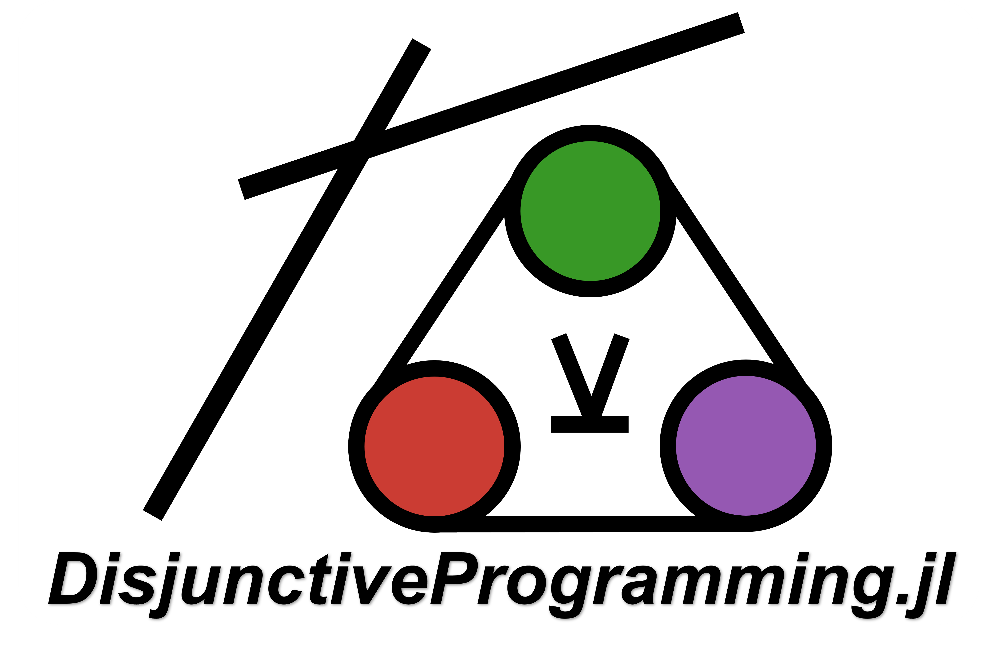

# DisjunctiveProgramming.jl

A Generalized Disjunctive Programming (GDP) extension to JuMP.



[](https://codecov.io/gh/hdavid16/DisjunctiveProgramming.jl)
[](https://hdavid16.github.io/InventoryManagement.jl/stable/)
[](https://hdavid16.github.io/InventoryManagement.jl/dev/)

## Installation

```julia
using Pkg
Pkg.add("DisjunctiveProgramming")
```

## Reference

The theory behind the GDP modeling paradigm is described in the following references:

- [JuliaCon 2022 Proceedings](https://proceedings.juliacon.org/papers/10.21105/jcon.00117)
- [Perez and Grossmann (2023)](https://arxiv.org/abs/2303.04375)
- [Generalized Disjunctive Programming](https://optimization.cbe.cornell.edu/index.php?title=Convex_generalized_disjunctive_programming_(GDP))
- [Disjunctive Inequalities](https://optimization.cbe.cornell.edu/index.php?title=Disjunctive_inequalities)

## Citing

[](https://doi.org/10.21105/jcon.00117)

If you use DisjunctiveProgramming.jl in your research, we would greatly appreciate your
citing it.

```latex
@article{Perez2023,
  title = {DisjunctiveProgramming.jl: Generalized Disjunctive Programming Models and Algorithms for JuMP},
  author = {Hector D. Perez and Shivank Joshi and Ignacio E. Grossmann},
  journal = {Proceedings of the JuliaCon Conferences},
  year = {2023},
  publisher = {The Open Journal},
  volume = {1},
  number = {1},
  pages = {117}
}
```

## Model

A generalized disjunctive programming (GDP) model is created using [`GDPModel`](@ref), where the optimizer can be passed at model creation, along with other keyword arguments supported by JuMP Models.

```julia
using DisjunctiveProgramming
using HiGHS

model = GDPModel(HiGHS.Optimizer)
```

A [`GDPModel`](@ref) is a `JuMP Model` with a [`GDPData`](@ref) field in the model's `.ext` dictionary, which stores the following:

- `Logical Variables`: Indicator variables used for the various disjuncts involved in the model's disjunctions.
- `Logical Constraints`: Selector (cardinality) or proposition (Boolean) constraints describing the relationships between the logical variables.
- `Disjunct Constraints`: Constraints associated with each disjunct in the model.
- `Disjunctions`: Disjunction constraints.
- `Solution Method`: The reformulation technique or solution method. Currently, supported methods include Big-M, Hull, and Indicator Constraints.
- `Reformulation Variables`: List of JuMP variables created when reformulating a GDP model into a MIP model.
- `Reformulation Constraints`: List of constraints created when reformulating a GDP model into a MIP model.
- `Ready to Optimize`: Flag indicating if the model can be optimized.

Additionally, the following mapping dictionaries are stored in `GDPData`:

- `Indicator to Binary`: Maps the Logical variables to their respective reformulated Binary variables.
- `Indicator to Constraints`: Maps the Logical variables to the disjunct constraints associated with them.

A GDP Model's `GDPData` can be accessed via:

```julia
data = gdp_data(model)
```

## Logical Variables

Logical variables are JuMP `AbstractVariable`s with two fields: `fix_value` and `start_value`. These can be optionally specified at variable creation. Logical variables are created with the `@variable` JuMP macro by adding the tag [`Logical`](@ref) as the last keyword argument. As with the regular `@variable` macro, variables can be named and indexed:

```julia
@variable(model, Y[1:3], Logical)
```

When making logical variables for disjunctions with only two disjuncts, we can use the `logical_compliment` argument to prevent creating uncessary binary variables when reformulating:

```julia

@variable(model, Y1, Logical)
@variable(model, Y2, Logical, logical_compliment = Y1) # Y2 ⇔ ¬Y1
```

## Logical Constraints

Two types of logical constraints are supported:

1. `Selector` or cardinality constraints: A subset of Logical variables is passed and [`Exactly`](@ref), [`AtMost`](@ref), or [`AtLeast`](@ref) `n` of these is allowed to be `true`. These constraints are specified with the `func` $\in$ `set` notation in `MathOptInterface` in a `@constraint` JuMP macro. It is not assumed that disjunctions have an `Exactly(1)` constraint enforced on their disjuncts upon creation. This constraint must be explicitly specified.

    ```julia
    @constraint(model, [Y[1], Y[2]] in Exactly(1))
    ```

2. `Proposition` or Boolean constraints: These describe the relationships between Logical variables via Boolean algebra. Supported logical operators include:

    - `∨` or `logical_or` or `||` (OR, typed with `\vee + tab`).
    - `∧` or `logical_and` or `&&` (AND, typed with `\wedge + tab`).
    - `¬` or `logical_not` (NOT, typed with `\neg + tab`).
    - `⟹` of `implies` (Implication, typed with `\Longrightarrow + tab`).
    - `⇔` or `iff` or `==` (double implication or equivalence, typed with `\Leftrightarrow + tab`).

The `@constraint` JuMP macro is used to create these constraints with `:=`:

```julia
@constraint(model, Y[1] ⟹ Y[2] := true)
```

_DisjunctiveProgramming.jl_ will automatically reformulate Logical propositions to integer programming constraints by converting these expressions to [Conjunctive Normal Form](https://en.wikipedia.org/wiki/Conjunctive_normal_form), and then to algebraic constraints.

Variable splatting is supported in the logical operator functions `logical_or`, `logical_and`, `logical_not`, `implies`, and `iff` such that

```julia
@constraint(model, logical_and(Y...) := true)
```

is equivalent to

```julia
@constraint(model, Y[1] ∧ Y[2] := true)
```

## Disjunctions

Disjunctions are built by first defining the constraints associated with each disjunct. This is done via the `@constraint` JuMP macro with the extra [`Disjunct`](@ref) tag specifying the Logical variable associated with the constraint:

```julia
@variable(model, x)
@constraint(model, x ≤ 100, Disjunct(Y[1]))
@constraint(model, x ≥ 200, Disjunct(Y[2]))
```

After all disjunct constraints associated with a disjunction have been defined, the disjunction is created with the [`@disjunction`](@ref) macro, where the disjunction is defined as a `Vector` of Logical variables associated with each disjunct:

```julia
@disjunction(model, [Y[1], Y[2]])
```

Disjunctions can be nested by passing an additional [`Disjunct`](@ref) tag. The Logical variable in the `Disjunct` tag specifies which disjunct, the nested disjunction belongs to:

```julia
@disjunction(model, Y[1:2], Disjunct(Y[3]))
```

Empty disjuncts are supported in GDP models. When used, the only constraints enforced on the model when the empty disjunct is selected are the global constraints and any other disjunction constraints defined.

For convenience, the `Exactly(1)` selector constraint is added by default when adding a disjunction to the model. In other words, `@disjunction(model, Y)` will add the disjunction and automatically add the logical constraint `Y in Exactly(1)`. For nested disjunctions, the appropriate `Exactly` constraint is added (e.g., `@constraint(model, Y[1:2] in Exactly(Y[3]))`) to indicate that `Exactly 1` logical variable in `Y[1:2]` is set to `true` when `Y[3]` is `true`, and both variables in `Y[1:2]` are set to `false` when `Y[3]` is `false`, meaning the parent disjunct is not selected. Adding the `Exactly` selector constraint by default can be disabled by setting the keyword argument `exactly1` to `false` in the `@disjunction` macro.

## MIP Reformulations

The following reformulation methods are currently supported:

1. [Big-M](https://optimization.cbe.cornell.edu/index.php?title=Disjunctive_inequalities#Big-M_Reformulation[1][2]): The [`BigM`](@ref) struct is used.

2. [Hull](https://optimization.cbe.cornell.edu/index.php?title=Disjunctive_inequalities#Convex-Hull_Reformulation[1][2]): The [`Hull`](@ref) struct is used.

3. [Indicator](https://jump.dev/JuMP.jl/stable/manual/constraints/#Indicator-constraints): This method reformulates each disjunct constraint into an indicator constraint with the Boolean reformulation counterpart of the Logical variable used to define the disjunct constraint. This is invoked with [`Indicator`](@ref).

## Release Notes

Prior to `v0.4.0`, the package did not leverage the JuMP extension capabilities and was not as robust. For these earlier releases, refer to [Perez, Joshi, and Grossmann, 2023](https://arxiv.org/abs/2304.10492v1) and the following [JuliaCon 2022 Talk](https://www.youtube.com/watch?v=AMIrgTTfUkI).

## Example

The example below is from the [Cornell University Computational Optimization Open Textbook](https://optimization.cbe.cornell.edu/index.php?title=Disjunctive_inequalities#Big-M_Reformulation[1][2]).

```julia
using DisjunctiveProgramming
using HiGHS

m = GDPModel(HiGHS.Optimizer)
@variable(m, 0 ≤ x[1:2] ≤ 20)
@variable(m, Y[1:2], Logical)
@constraint(m, [i = 1:2], [2,5][i] ≤ x[i] ≤ [6,9][i], Disjunct(Y[1]))
@constraint(m, [i = 1:2], [8,10][i] ≤ x[i] ≤ [11,15][i], Disjunct(Y[2]))
@disjunction(m, Y)
@objective(m, Max, sum(x))
print(m)
# Max x[1] + x[2]
# Subject to
#  x[1] ≥ 0
#  x[2] ≥ 0
#  x[1] ≤ 20
#  x[2] ≤ 20

##
optimize!(m, gdp_method = BigM(100, false)) #specify M value and disable M-tightening
print(m)
# Max x[1] + x[2]
# Subject to
#  Y[1] + Y[2] = 1
#  x[1] - 100 Y[1] ≥ -98
#  x[2] - 100 Y[1] ≥ -95
#  x[1] - 100 Y[2] ≥ -92
#  x[2] - 100 Y[2] ≥ -90
#  x[1] + 100 Y[1] ≤ 106
#  x[2] + 100 Y[1] ≤ 109
#  x[1] + 100 Y[2] ≤ 111
#  x[2] + 100 Y[2] ≤ 115
#  x[1] ≥ 0
#  x[2] ≥ 0
#  x[1] ≤ 20
#  x[2] ≤ 20
#  Y[1] binary
#  Y[2] binary

##
optimize!(m, gdp_method = Hull())
print(m)
# Max x[1] + x[2]
# Subject to
#  -x[2] + x[2]_Y[1] + x[2]_Y[2] = 0
#  -x[1] + x[1]_Y[1] + x[1]_Y[2] = 0
#  Y[1] + Y[2] = 1
#  -2 Y[1] + x[1]_Y[1] ≥ 0
#  -5 Y[1] + x[2]_Y[1] ≥ 0
#  -8 Y[2] + x[1]_Y[2] ≥ 0
#  -10 Y[2] + x[2]_Y[2] ≥ 0
#  x[2]_Y[1]_lower_bound : -x[2]_Y[1] ≤ 0
#  x[2]_Y[1]_upper_bound : -20 Y[1] + x[2]_Y[1] ≤ 0
#  x[1]_Y[1]_lower_bound : -x[1]_Y[1] ≤ 0
#  x[1]_Y[1]_upper_bound : -20 Y[1] + x[1]_Y[1] ≤ 0
#  x[2]_Y[2]_lower_bound : -x[2]_Y[2] ≤ 0
#  x[2]_Y[2]_upper_bound : -20 Y[2] + x[2]_Y[2] ≤ 0
#  x[1]_Y[2]_lower_bound : -x[1]_Y[2] ≤ 0
#  x[1]_Y[2]_upper_bound : -20 Y[2] + x[1]_Y[2] ≤ 0
#  -6 Y[1] + x[1]_Y[1] ≤ 0
#  -9 Y[1] + x[2]_Y[1] ≤ 0
#  -11 Y[2] + x[1]_Y[2] ≤ 0
#  -15 Y[2] + x[2]_Y[2] ≤ 0
#  x[1] ≥ 0
#  x[2] ≥ 0
#  x[2]_Y[1] ≥ 0
#  x[1]_Y[1] ≥ 0
#  x[2]_Y[2] ≥ 0
#  x[1]_Y[2] ≥ 0
#  x[1] ≤ 20
#  x[2] ≤ 20
#  x[2]_Y[1] ≤ 20
#  x[1]_Y[1] ≤ 20
#  x[2]_Y[2] ≤ 20
#  x[1]_Y[2] ≤ 20
#  Y[1] binary
#  Y[2] binary
```

## Contributing

`DisjunctiveProgramming` is being actively developed and suggestions or other forms of contribution are encouraged.
There are many ways to contribute to this package. Feel free to create an issue to address questions or provide feedback.
